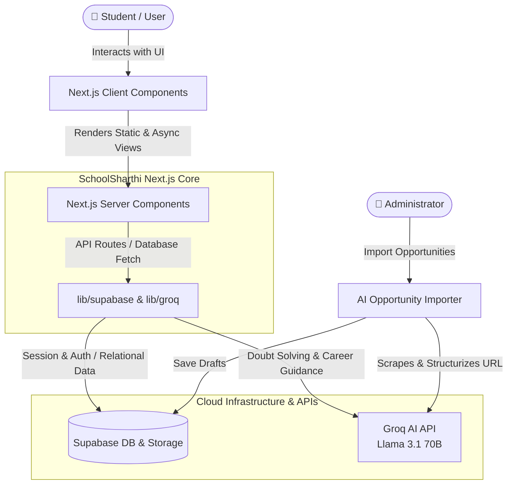

# 🎓 SchoolSharthi — Har Student Ka Sachcha Sharthi

[](https://nextjs.org/)
[](https://supabase.com/)
[](https://groq.com/)
[](https://www.typescriptlang.org/)
[](https://tailwindcss.com/)

**SchoolSharthi** is an AI-powered student growth and guidance platform designed to empower every school student — especially in rural and underserved areas — with access to premium educational resources, scholarships, career mapping, and doubt-solving assistance. 

---

## 🌟 Mission & Philosophy
Most EdTech platforms focus solely on note-sharing or English-speaking urban classrooms. SchoolSharthi changes the paradigm. We believe in providing a holistic **Student Growth Platform** that adapts to a child's language (Hindi, English, or Hinglish) and fits their environment (running smoothly on low-end Android smartphones and 2G/3G connections).

### The Core Challenges We Solve
- 🛣️ **Lack of Guidance:** Providing personalized career roadmaps after Class 10 and 12.
- 💰 **Information Asymmetry:** Surfacing scholarships, Olympiads, and government programs that students miss out on.
- 📚 **Resource Accessibility:** Class-wise and subject-wise notes along with Previous Year Questions (PYQs).
- 🗣️ **Language Barrier:** Multi-lingual support tailored for Hindi and Hinglish-medium students.

---

## 🗺️ System Architecture

The following diagram represents the end-to-end flow of data and client-server interactions in SchoolSharthi V1:



---

## ⚡ Core Modules

### 1. 🤖 AI Guide
An intelligent, context-aware companion optimized for bilingual text input.
* **Capabilities:** Answers academic questions, details career paths, explains complex equations, and searches scholarship rules.
* **Localization:** Responds in the student's native input tongue (Hindi, English, or Hinglish).
* **Engine:** Powered by Groq's low-latency API utilizing `llama-3.1-70b-versatile`.

### 2. 📝 Notes Hub
A structured repository offering curated study assets categorized for classes 6 through 12.
* Dynamic filtering by Subject, Class, and Document Type (PDF Notes, PYQs).
* Mobile-responsive interface designed for quick load times over rural cellular networks.

### 3. 🧭 Career Explorer
Interactive, domain-specific deep dives for standard and modern vocational pathways (e.g., Medicine, Engineering, Civil Services, Chartered Accountancy, Defense, and beyond).
* Includes skills checklists, academic milestones, examinations, and future outlook forecasts.

### 4. 🏆 Opportunities Hub
A clean notice board listing active state-level and national scholarships, competitive Olympiads, and student benefit programs.
* Search and sort mechanisms with absolute focus on registration deadlines and application portals.

### 5. ⚡ AI Opportunity Importer (Admin Tool)
Empowers administrators to scrape and import new scholarships easily. Just paste the URL of a government notification page; the LLM parses the content, structurizes metadata, and queues a draft for instant admin authorization.

---

## 🛠️ Tech Stack & Design System

* **Framework:** Next.js 15 (using App Router, Server Actions, & Server Components).
* **Database & Authentication:** Supabase (PostgreSQL with built-in Auth and secure Storage Buckets).
* **AI Orchestration:** Groq SDK.
* **Styling & Components:** Tailwind CSS & shadcn/ui.
* **Visual Palette:** Academic & Premium minimal styling.
  * Background: `#FFFFFF` / Surface: `#F8F7F4` (soft warm white)
  * Accent: Accent Gold (`#D4AF37`) for critical focal points
  * Primary Text: Soft Slate/Charcoal (`#111111`)
  * Typography: Playfair Display (headings) + Inter (body copy)

---

## 📂 Repository Structure

The project directory structure is modularized logically, dividing interactive client logic and heavy server configurations:

```text
schoolsharthi/
├── app/                   # Next.js App Router (Pages, API Routes, Layouts)
│   ├── admin/             # Administrator dashboard & AI importer tool
│   ├── ai-guide/          # Chat interface for student guidance
│   ├── careers/           # Directory paths & dynamic slug pages
│   ├── notes/             # Searchable study notes hub
│   ├── opportunities/     # Scholarships and competitive exams finder
│   ├── profile/           # Personalized user settings and tracking
│   ├── api/               # API endpoints (AI client connection)
│   └── globals.css        # Core styling sheet
├── components/            # UI Components grouped by system module
│   ├── layout/            # Core navbar & footer templates
│   ├── home/              # Landing page visual components
│   ├── notes/             # Filtering & grid assets for study files
│   ├── careers/           # Career detailed maps and cards
│   ├── opportunities/     # Visual cards representing deadlines
│   └── ai-guide/          # Dynamic scrollable chat window component
├── lib/                   # Utility helpers and initializers
│   ├── supabase/          # Supabase client (Client & Server configurations)
│   └── groq.ts            # Groq model configurations
├── types/                 # Consolidated TypeScript interfaces
└── public/                # Static assets, branding logos, and illustrations
```

---

## 🚀 Getting Started

Follow these steps to run a local instance of SchoolSharthi:

### Prerequisites
Make sure you have [Node.js](https://nodejs.org/) (version 18.x or above) installed on your system.

### 1. Clone the Project
```bash
git clone https://github.com/karan033-cybertech/schoolsharthi-v1.git
cd schoolsharthi-v1
```

### 2. Install Dependencies
```bash
npm install
```

### 3. Setup Environment Variables
Create a local environment file by copying the template:
```bash
cp .env.example .env.local
```
Open `.env.local` and enter your Supabase connection parameters and Groq API token.

### 4. Run the Development Server
```bash
npm run dev
```
Open [http://localhost:3000](http://localhost:3000) in your browser to inspect the application.

---

## 📐 Database Schema Setup
To configure the Supabase PostgreSQL database, initialize the following schemas:

* **`users` / `profiles`** — Handles student profile mapping, targets, and classes.
* **`notes`** — Holds academic files, metadata, class classifications, and download paths.
* **`careers`** — Holds career routes, examination listings, and specific roadmap details.
* **`opportunities`** — Records scholarships, deadlines, categories, and redirect URLs.
* **`draft_imports`** — Temporary storage for automated imports awaiting approval.

---

## 📖 Development Rules & Guidelines
To maintain a high-quality codebase, all updates must strictly adhere to the following standards:

1. **Strict TypeScript:** No use of `any` types. Ensure interfaces are properly documented inside [types/index.ts](file:///E:/SchoolSharthi%20v1/types/index.ts).
2. **Server-First Approach:** Keep components as React Server Components (RSC) by default. Use `"use client"` solely for interactive client-side sub-components.
3. **Database Access Layer:** Initialize Supabase database clients inside [lib/supabase/](file:///E:/SchoolSharthi%20v1/lib/supabase/) ONLY. Never instantiate inline database connections.
4. **Optimized Assets:** Use the Next.js `Image` component (`next/image`) for all asset imports to ensure fast, responsive loads on slower cellular connections.

---

## 🛡️ License
Distributed under the MIT License. See `LICENSE` for more information.

---
*Developed with ❤️ for the students of India. **Har Student Ka Sachcha Sharthi.***
